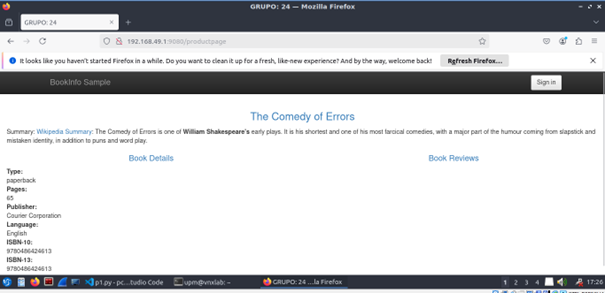
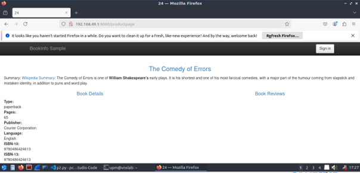
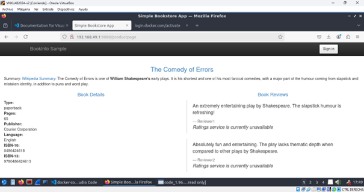
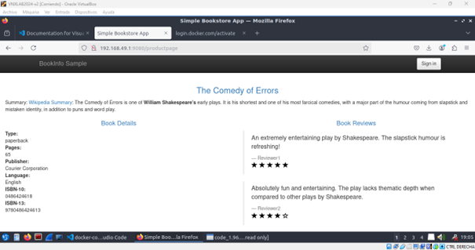
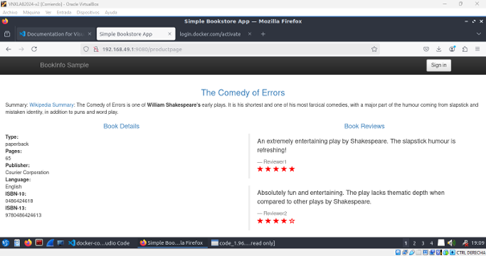

# MEMORIA PRÁCTICA CREATIVA 2

## GRUPO 24: Cristina Rodríguez Lozano, Elsa Sastre del Olmo y Lucía Martínez Seijas

---

## 1. Despliegue de la Aplicación en Máquina Virtual Pesada

Para el despliegue de la aplicación como monolito, hemos desarrollado un script llamado `p1.py` que automatiza el proceso de instalación y configuración. Este script realiza las siguientes tareas:

1. **Actualización del sistema**: Asegura que la máquina tenga los paquetes actualizados.
2. **Clonación del repositorio**: Clona el repositorio de la práctica que contiene el código de la aplicación.
3. **Instalación de dependencias**: Instala las dependencias especificadas en el archivo `requirements.txt` del proyecto usando `pip3`.
4. **Personalización del título**: Configura la variable de entorno `GROUP_NUM` con el valor `24` y modifica el archivo `productpage.html` para que el título de la aplicación incluya el número del grupo.
5. **Cambio de puerto de ejecución**: La aplicación, que por defecto escucha en el puerto `9080`, se ejecuta en un puerto configurable para adaptarse a diferentes configuraciones.
6. **Acceso externo**: La aplicación es accesible desde cualquier navegador mediante la IP pública y el puerto configurado: `http://<ip-pública>:<puerto>/productpage`.
7. **Liberación de recursos**: Permite liberar recursos eliminando los archivos generados durante el proceso.

### Ejecución
Para probar la funcionalidad, ejecutamos el script en la máquina con la IP local de nuestro ordenador, utilizando el siguiente comando:

```bash
python3 p1.py arrancar
```

En el navegador buscamos:

```text
http://<ip-local>:9080/productpage
```

La aplicación muestra correctamente la interfaz gráfica con el título: **"GRUPO 24"**.


---

## 2. Despliegue de una Aplicación Monolítica Usando Docker

Ahora queremos desplegar la misma aplicación monolítica utilizada en la p1, pero empleando contenedores Docker.

### Dockerfile
Hemos definido un fichero `Dockerfile` con las siguientes características:

- Usa como base la imagen `python:3.7.7-slim`.
- Instala dependencias necesarias como `git` y `pip3`.
- Clona el repositorio con el código de la aplicación.
- Configura la variable de entorno `GROUP_NUM` con el valor `24` para personalizar el título de la página.
- Expone el puerto `5060` y ejecuta la aplicación.

### Script
Hemos desarrollado un script (`p2.py`) que automatiza el proceso de construcción y ejecución del contenedor Docker con las siguientes funcionalidades:

1. **Construcción de la imagen Docker**: Usa el formato `productpage/24`.
2. **Ejecución del contenedor**:
   - Nombre: `productpage-24`.
   - Puerto: `5060`.
   - Variable de entorno: `GROUP_NUM=24`.
3. **Liberación de recursos**: Detiene y elimina contenedores e imágenes Docker al finalizar.

### Ejecución
El script fue ejecutado en una máquina local con Docker instalado, usando el siguiente comando:

```bash
python3 p2.py crear
```

En el navegador buscamos:

```text
http://<ip-local>:9080/productpage
```

La aplicación muestra correctamente la interfaz gráfica con el título **"24"**.


---
## 3. Segmentación de una Aplicación Monolítica en Microservicios utilizando Docker-Compose

En esta parte de la práctica, se segmentó la aplicación en microservicios para que cada servicio funcione de manera independiente utilizando Docker-Compose. Además, se añadieron dos servicios adicionales: Reviews y Ratings. La aplicación ahora es "políglota", ya que cada microservicio está desarrollado en un lenguaje diferente.

### Dockerfiles
Se definieron archivos `Dockerfile` para cada microservicio con las siguientes configuraciones:

1. **Product Page**:
   - Imagen base: Python.
   - Instalación de las dependencias especificadas en el archivo `requirements.txt`.
   - Ejecución del archivo `productpage.py`.

2. **Details**:
   - Imagen base: Ruby.
   - Copia del archivo `details.rb` en la ruta `/opt/microservices/`.
   - Configuración de las variables de entorno:
     - `SERVICE_VERSION=v1`
     - `ENABLE_EXTERNAL_BOOK_SERVICE=true`
   - Exposición del puerto `9080`.
   - Ejecución del archivo `details.rb` con Ruby.

3. **Ratings**:
   - Imagen base: Node.js.
   - Copia de los archivos `ratings.js` y `package.json` en la ruta `/opt/microservices/`.
   - Configuración de la variable de entorno:
     - `SERVICE_VERSION=v1`
   - Exposición del puerto `9080`.
   - Ejecución del archivo `ratings.js` con Node.js.

### Docker-Compose
Se creó un archivo `docker-compose.yaml` con las siguientes características:

- Definición de contenedores para cada microservicio.
- Los nombres de los contenedores siguieron el formato `<nombre_del_servicio>-24` para mantener la uniformidad.
- Establecimiento de la imagen utilizada para crear cada contenedor.
- Configuración de la variable de entorno `ENABLE_RATINGS=true` para activar los ratings.

### Script
El script desarrollado automatiza las siguientes tareas:

1. Clona el repositorio del código de la aplicación.
2. Construye las imágenes de Docker con el comando `docker compose build`.
3. Compila el microservicio Reviews utilizando Gradle.
4. Construye tres imágenes diferentes para cada versión de Reviews (v1, v2 y v3) utilizando su `Dockerfile`.
5. Inicia la aplicación con `docker compose up`.

### Ejecución
El script fue ejecutado en una máquina local utilizando el siguiente comando:

```bash
python3 p3.py crear
```

Desde el navegador, se realizaron pruebas con las tres versiones del microservicio Reviews, accediendo a:

```text
http://192.168.49.1:9080/productpage
```

Cambiando en el archivo `docker-compose.yaml` la versión de la imagen del microservicio Reviews utilizada, se obtuvieron las siguientes vistas de la aplicación:

- **Versión 1**:

  

- **Versión 2**:

  

- **Versión 3**:

  

### Diferencias con la versión monolítica

1. **Escalabilidad**:
   - Cada microservicio puede escalarse de manera independiente, mejorando el uso de recursos.

2. **Modularidad**:
   - La gestión y el mantenimiento de los servicios son más fáciles al estar separados.

3. **Desempeño**:
   - Cada microservicio puede optimizarse de manera individual para sus necesidades específicas.

